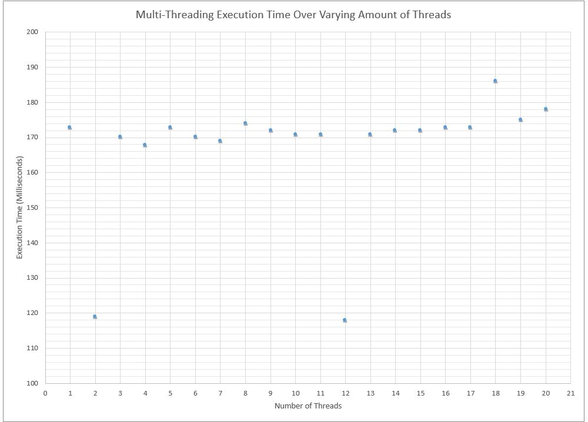

#####REPORT

##Implementation Summary
The design that we have implemented, when given a directory of text files, will calculate the word counts of 
these files by "passing out" close-to-equal numbers of files to each thread up front. Each thread then counts 
the words of the files in a hashtable (where the key is a given word and the value is the number of times
that word appears). After each thread processes its designated files, it merges its accumulated data
into the 'master' hashtable, which collects the results of all threads. Once all threads have merged into 
this table and returned to main program execution thread, a single output file is generated from this master
hashtable, so that the final file contains all the data.

##Challenges

[]How did you solve each challenge in task 2? Be specific, add pseudo code if you need to.

####Input Challenges   
###### Splitting data across multiple threads:

   
..* In single thread, our program took in entire directory of suitable files to read. With multiple threads, 
this approach inspired us to give each thread a similar list of files to read and report upon. Using 
 code that we already were familiar with, instead of dividing documents line by line, allowed us to
move forward with dependably accurate word-count code while solving trickier issues. Having confidence in 
this algorithm allowed us to isolate and solve nastier bugs as they arose. --runtime takes more to 
load all the lines and ensure 'fairness'

..* Initially, we toyed with the idea of a queue or stack of "unread" files, which any available thread
 would 'pop' a new file from when ready, but we decided to split the files up front and give each thread 
 their own unread list. One disadvantage of this is that overall execution may be slower because it's 
 possible for one thread to be assigned larger files by chance, causing all other threads to wait for it to
 finish its larger jobs before overall execution can complete. However, this approach is overall advantageous
 because it excludes the possibility of race conditions occurring with the file list, so no files will be
 lost in some sort of double-popping mistake.
		
		 
####Output Challenges
######Single output file:  (Hey Hannah I'm not sure these sentences make sense)
The constraint of outputting data to the same file encouraged a lot of thought about I/O and restricting 
threads' access to the final file. However, we found that if we wait until writing to a file to combine data 
from different input files, further challenges arose with combining duplicate words found. Instead of modifying
the hash tables after sending their data out to a text file, we decided to compile the data from all 
the threads into a "master" hash table, which will be output to a text file after all the threads have
finished and entered their information.

To ensure accurate results in the master hashtable, we added two parts to our design.
The first is our `mergeWithMaster` method, which adds another hashtable into the results of the master,
 adding a new
key/value pair if the word had not been previously found or adding the new value to the existing key's value
if the key was already in master. The other part of our design ensures that no two threads attempt to alter
the master hashtable at the same time. Because we only alter this hashtable as shared content between threads,
we trimmed our critical section down to only the merging of the 'instance' hashtables with the master, 
so threads can run as much code as possible before potentially being blocked by semaphores.

####Other Challenges
######Static Variables
Because we used static variables to share data between threads, we had/have to ensure
that our code is freshly compiled before each run (ex. to set the master hashtable back to null) so that the
count of each words starts from zero every run.

####Semaphores
###### `mutex`
We used mutex to permit only one thread accessing `master` hashtable at a time. Immediately before merging,
the thread must `acquire` mutex, and it's released immediately after `merge` returns, 

###### `allDone`
The allDone semaphore guarantees that all threads have terminated and submitted their data before
generating an output file from master, finalizing the output process.

``` 
//thread finishes processing its assigned files
mergeWithMaster(thisTable);
allDone.release() //signals thread has successfully merged with master hashtable
allDone.acquire() //attempts aquisition as signal to create output file, only possible
                  //after all other threads merge tambles
master.output(outputFileName.txt) //the thread that aquires the allDone is solely responsible
                                  //for generating output
```

[] Did you face any other challenges? How did you solve them?

##Running Time Comparisons

####Single Thread vs 1 Thread Option on Multiple Threads
We found that our single threaded application had a much longer runtime than the multithreaded
 application with one thread specified. When processing the same files, our single threaded application
  took 6081-6833 milliseconds to complete while the multithreaded application with one thread specifed 
  took only about 171 milliseconds to complete th same job. We were very puzzled by this outcome, and did
   a lot of investigation to make sure both applications were truly [rpcessing the same files. We did not 
   find any mistakes and it appears that both applications were processing the same files. We hypothesize 
   that the multi-threaded application takes a shorter amount of time because a separate thread from the main
    java thread is being created and used to proess the text documents, so the main java thread does not have
     to process those documents. 


####Varying Multiple Threads

#####Runtime Graph


We found that our runtimes plateaued almost immediately. As seen in the graph above, most runtimes 
hovered around 170 milliseconds (without any print statements) with some outliers dropping down to around
 120 milliseconds. We believe these outliers were "lucky" runs that were able to be scheduled by the CPU
  almost immediately. 

We ran the code over a directory containing 15 large classic books downloaded from gutenberg.org.
 These books were Alice in Wonderland, the Picture of Dorian Gray, A tale of Two Cities, Emma,
  Frankenstein, Pride and Prejudice, the Adventures of Sherlock Holmes, Ulysses, Great Expectations,
Jane Eyre, Les Miserables, Moby Dick, the Complete Works of Shakespeare, War and Peace, and Wuthering Heights. 


####Discussion
We started this project by figuring out how to create a word counter without thinking about threads. 
We first looked online to see how others had implemented this kind of word counter.
 We found [this](http://stackoverflow.com/questions/30084511/add-words-frequency-to-hashtable) 
stack overflow question with a similar intent. We took that code and improved the efficiency of the example.
 Once our single threaded application was finished, we focused our attention on the Multi threaded
  application. We heavily relied on class examples and Oracle java documentation for examples of Semaphores.
   We also consulted Chapter 31 of **Operating Systems: Three Easy Pieces by Remzi H. Arpaci-Dusseau and
 Andrea C. Arpaci-Dusseau** for help with Semaphores and multi-threading design.

We were very fortunate to both be proficient in the Java programming language and GitHub. These tools 
enabled us to focus our efforts on strengthening our multithreading knowledge and limited logistical 
challenges for us. 


